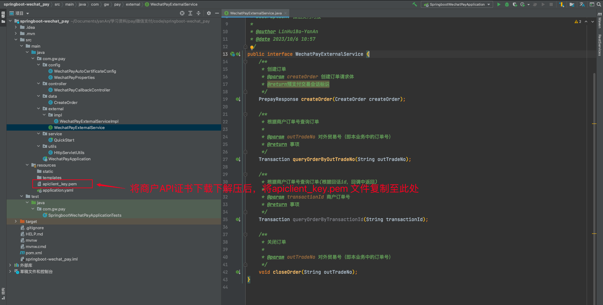

相较于 v2 版本，v3 版本的接口文档在阅读上可能显得相对凌乱。它的组织结构可能不太清晰，难以快速理解整个流程。但是，一旦我们对基本流程有了大致了解，我们可以利用 [wechatpay-java](https://github.com/wechatpay-apiv3/wechatpay-java) 来简化开发过程（一把梭哈）。

相关api文档：[小程序支付API列表](https://pay.weixin.qq.com/wiki/doc/apiv3/open/pay/chapter2_8_3.shtml)

微信公众平台：[微信公众平台](https://mp.weixin.qq.com/)


# 用户付款流程

如图1，用户通过分享或扫描二维码进入商户小程序，用户选择购买，完成选购流程。

步骤2：如图3，调起微信支付控件，用户开始输入支付密码。

|  |  |  |
| ------------------------------------------------------------ | ------------------------------------------------------------ | ------------------------------------------------------------ |
| 图1 打开商户小程序                                           | 图2 请求微信支付                                             | 图3 调起微信支付控件                                         |

如图4，密码验证通过，支付成功。商户后台得到支付成功的通知。

步骤4：如图5，返回商户小程序，显示购买成功。

步骤5：如图6，微信支付公众号下发支付凭证。

|  图4 请求支付成功 |  图5 返回商户小程序 |  |
| ------------------------------------------------------------ | ------------------------------------------------------------ | ------------------------------------------------------------ |
| 图4 请求支付成功                                             | 图5 返回商户小程序                                           | 图6 下发支付凭证                                             |


# 业务流程讲解

业务流程图如下：


重点步骤说明：

步骤4：用户下单发起支付，商户可通过[JSAPI下单](https://pay.weixin.qq.com/wiki/doc/apiv3/apis/chapter3_5_1.shtml)创建支付订单。

步骤9：商户小程序内使用[小程序调起支付API](https://pay.weixin.qq.com/wiki/doc/apiv3/apis/chapter3_5_4.shtml)（wx.requestPayment）发起微信支付，详见[小程序API文档](https://developers.weixin.qq.com/miniprogram/dev/api/payment/wx.requestPayment.html)

步骤16：用户支付成功后，商户可接收到微信支付支付结果通知[支付通知API](https://pay.weixin.qq.com/wiki/doc/apiv3/apis/chapter3_5_5.shtml)。

步骤21：商户在没有接收到微信支付结果通知的情况下需要主动调用[查询订单API](https://pay.weixin.qq.com/wiki/doc/apiv3/apis/chapter3_5_2.shtml)查询支付结果。


# 接入前准备

详细操作流程参考官方文档：https://pay.weixin.qq.com/wiki/doc/apiv3/open/pay/chapter2_8_1.shtml#part-1

- Java 1.8+。
- [成为微信支付商户](https://pay.weixin.qq.com/index.php/apply/applyment_home/guide_normal)。
- [商户 API 证书](https://pay.weixin.qq.com/docs/merchant/development/interface-rules/privatekey-and-certificate.html#%E5%95%86%E6%88%B7api%E8%AF%81%E4%B9%A6)：指由商户申请的，包含[证书序列号](https://pay.weixin.qq.com/docs/merchant/development/interface-rules/certificate-faqs.html#%E5%A6%82%E4%BD%95%E6%9F%A5%E7%9C%8B%E8%AF%81%E4%B9%A6%E5%BA%8F%E5%88%97%E5%8F%B7)、商户的商户号、公司名称、公钥信息的证书。
- [商户 API 私钥](https://pay.weixin.qq.com/docs/merchant/development/interface-rules/privatekey-and-certificate.html#%E5%95%86%E6%88%B7api%E7%A7%81%E9%92%A5)：商户申请商户API证书时，会生成商户私钥，并保存在本地证书文件夹的文件 apiclient_key.pem 中。
- [APIv3 密钥](https://pay.weixin.qq.com/docs/merchant/development/interface-rules/apiv3key.html)：为了保证安全性，微信支付在回调通知和平台证书下载接口中，对关键信息进行了 AES-256-GCM 加密。APIv3 密钥是加密时使用的对称密钥。

> 最终我们需要获取到以下信息：
>
> + **appId**：微信公众号或者小程序等的appId（登陆 微信公众平台，设置 -> 基本设置 -> 账号信息 -> AppID）
> + **merchantId**：微信支付商户号（首先关联商户号，功能 -> 微信支付 -> 商户号管理 -> 已关联商户号）
> + **privateKeyPath**：商户API私钥（[商户 API 证书](https://pay.weixin.qq.com/docs/merchant/development/interface-rules/privatekey-and-certificate.html#%E5%95%86%E6%88%B7api%E8%AF%81%E4%B9%A6)根据文档获取，将`apiclient_key.pem`文件复制至项目路径下。该文件在resource下路径）
> + **merchantSerialNumber**：商户证书序列号（登陆 商户平台，账户中心 -> API安全 -> API证书管理 -> 查看证书号）
> + **apiV3key**：商户APIv3密钥（登陆 商户平台，账户中心 -> API安全的页面 设置该密钥，请求才能通过微信支付的签名校验）
> + **payNotifyUrl**：支付回调通知地址（本项目的回调接口）


# 快速接入

项目结构如下，以及需要注意点



## 1、引入开发库

> Gradle

```arduino
implementation 'com.github.wechatpay-apiv3:wechatpay-java:0.2.10'
```

> Maven

```xml
<dependency>
  <groupId>com.github.wechatpay-apiv3</groupId>
  <artifactId>wechatpay-java</artifactId>
  <version>0.2.10</version>
</dependency>
```


## 2、配置参数

yaml配置文件：

```yaml
wechat:
  pay:
    # 微信公众号或者小程序等的appId
    appId: XXXX
    # 微信支付商户号
    merchantId: XXXX
    # 商户API私钥
    privateKeyPath: /apiclient_key.pem
    # 商户证书序列号
    merchantSerialNumber: XXXXX
    # 商户APIv3密钥
    apiV3key: XXXXX
    # 支付回调通知地址
    payNotifyUrl: https://XXXXXXXXXXX/api/v1/wechat/pay/callback
```

微信支付配置类

```java
package com.gw.pay.config;

import lombok.Data;
import org.springframework.boot.context.properties.ConfigurationProperties;
import org.springframework.stereotype.Component;

/**
 * Description: 微信支付配置类
 *
 * @author LinHuiBa-YanAn
 * @date 2023/10/6 10:27
 */
@Data
@Component
@ConfigurationProperties(prefix = "wechat.pay")
public class WechatPayProperties {
    /**
     * 微信公众号或者小程序等的appId
     */
    private String appId;
    /**
     * 微信支付商户号
     */
    private String merchantId;
    /**
     * 商户API私钥
     */
    private String privateKeyPath;
    /**
     * 商户证书序列号
     */
    private String merchantSerialNumber;
    /**
     * 商户APIv3密钥
     */
    private String apiV3key;
    /**
     * 支付回调通知地址
     */
    private String payNotifyUrl;
}
```


## 3、初始化商户配置

```java
package com.gw.pay.config;

import com.wechat.pay.java.core.RSAAutoCertificateConfig;
import lombok.extern.slf4j.Slf4j;
import org.springframework.beans.factory.annotation.Autowired;
import org.springframework.context.annotation.Bean;
import org.springframework.context.annotation.Configuration;
import org.springframework.core.io.Resource;
import org.springframework.core.io.ResourceLoader;

import java.io.BufferedReader;
import java.io.IOException;
import java.io.InputStream;
import java.io.InputStreamReader;


/**
 * Description: 初始化 具有自动下载并更新平台证书能力的RSA配置类并托关于spring
 *
 * @author LinHuiBa-YanAn
 * @date 2023/10/6 10:50
 */
@Slf4j
@Configuration
public class WechatPayAutoCertificateConfig {

    @Autowired
    private WechatPayProperties properties;

    @Autowired
    private ResourceLoader resourceLoader;

    private static final String CLASS_PATH = "classpath:";


    /**
     * 初始化商户配置
     * @return RSAAutoCertificateConfig
     */
    @Bean
    public RSAAutoCertificateConfig rsaAutoCertificateConfig() throws IOException {
        String privatePath = CLASS_PATH + properties.getPrivateKeyPath();
        Resource resourcePrivate = resourceLoader.getResource(privatePath);
        String privateKey = inputStreamToString(resourcePrivate.getInputStream());
        log.info("==========加载微信私钥配置:{}", privateKey);
        RSAAutoCertificateConfig config = new RSAAutoCertificateConfig.Builder()
                .merchantId(properties.getMerchantId())
                .privateKey(privateKey)
                .merchantSerialNumber(properties.getMerchantSerialNumber())
                .apiV3Key(properties.getApiV3key())
                .build();
        return config;
    }

    /**
     * 读取私钥文件，将文件流读取成string
     *
     * @param inputStream
     * @return
     * @throws IOException
     */
    public String inputStreamToString(InputStream inputStream) throws IOException {
        BufferedReader reader = new BufferedReader(new InputStreamReader(inputStream));
        StringBuilder stringBuilder = new StringBuilder();
        String line;
        while ((line = reader.readLine()) != null) {
            stringBuilder.append(line);
        }
        reader.close();
        return stringBuilder.toString();
    }

}
```


## 4、微信支付对接

在接口中定义了创建订单、根据商户订单号查询订单、关闭订单三类核心方法，几乎满足最基本的微信支付对接～

```java
package com.gw.pay.external;

import com.gw.pay.external.request.OrderRequest;
import com.wechat.pay.java.service.payments.jsapi.model.PrepayResponse;
import com.wechat.pay.java.service.payments.model.Transaction;

/**
 * Description: 微信支付对接
 *
 * @author LinHuiBa-YanAn
 * @date 2023/10/6 10:57
 */
public interface WechatPayExternalService {
    /**
     * 创建订单
     * @param createOrder 创建订单请求体
     * @return预支付交易会话标识
     */
    PrepayResponse createOrder(OrderRequest createOrder);

    /**
     * 根据商户订单号查询订单
     *
     * @param outTradeNo 对外贸易号（即本业务中的订单号）
     * @return 事项
     */
    Transaction queryOrderByOutTradeNo(String outTradeNo);

    /**
     * 根据商户订单号查询订单(根据回话id，回调中返回)
     *
     * @param transactionId 商户订单号
     * @return 事项
     */
    Transaction queryOrderByTransactionId(String transactionId);

    /**
     * 关闭订单
     *
     * @param outTradeNo 对外贸易号（即本业务中的订单号）
     */
    void closeOrder(String outTradeNo);
}
```

具体实现如下：

```java
package com.gw.pay.external.impl;

import com.gw.pay.config.WechatPayProperties;
import com.gw.pay.external.request.OrderRequest;
import com.wechat.pay.java.core.RSAAutoCertificateConfig;
import com.wechat.pay.java.core.exception.HttpException;
import com.wechat.pay.java.core.exception.MalformedMessageException;
import com.wechat.pay.java.core.exception.ServiceException;
import com.wechat.pay.java.service.payments.jsapi.JsapiService;
import com.wechat.pay.java.service.payments.jsapi.model.*;
import com.wechat.pay.java.service.payments.model.Transaction;
import lombok.extern.slf4j.Slf4j;
import org.springframework.stereotype.Service;

import javax.annotation.Resource;

/**
 * Description: 微信支付对接
 *
 * @author LinHuiBa-YanAn
 * @date 2023/10/6 10:58
 */
@Slf4j
@Service
public class WechatPayExternalServiceImpl implements WechatPayExternalService {

    @Resource
    private RSAAutoCertificateConfig rsaAutoCertificateConfig;

    @Resource
    private WechatPayProperties properties;

    @Override
    public PrepayResponse createOrder(OrderRequest createOrder) {
        PrepayRequest request = new PrepayRequest();
        request.setAppid(properties.getAppId());
        request.setMchid(properties.getMerchantId());
        request.setDescription(createOrder.getOrderTitle());
        request.setOutTradeNo(createOrder.getOrderId());
        request.setNotifyUrl(properties.getPayNotifyUrl());
        Amount amount = new Amount();
        amount.setTotal(createOrder.getAmountTotal());
        request.setAmount(amount);
        Payer payer = new Payer();
        payer.setOpenid(createOrder.getOpenid());
        request.setPayer(payer);
        PrepayResponse result;
        try {
            JsapiService service = new JsapiService.Builder().config(rsaAutoCertificateConfig).build();
            result = service.prepay(request);
        } catch (HttpException e) {
            log.error("微信下单发送HTTP请求失败，错误信息：{}", e.getHttpRequest());
            throw new RuntimeException("微信下单发送HTTP请求失败", e);
        } catch (ServiceException e) {
            // 服务返回状态小于200或大于等于300，例如500
            log.error("微信下单服务状态错误，错误信息：{}", e.getErrorMessage());
            throw new RuntimeException("微信下单服务状态错误", e);
        } catch (MalformedMessageException e) {
            // 服务返回成功，返回体类型不合法，或者解析返回体失败
            log.error("服务返回成功，返回体类型不合法，或者解析返回体失败，错误信息：{}", e.getMessage());
            throw new RuntimeException("服务返回成功，返回体类型不合法，或者解析返回体失败", e);
        }
        return result;
    }

    @Override
    public Transaction queryOrderByOutTradeNo(String outTradeNo) {
        QueryOrderByOutTradeNoRequest queryRequest = new QueryOrderByOutTradeNoRequest();
        queryRequest.setMchid(properties.getMerchantId());
        queryRequest.setOutTradeNo(outTradeNo);
        Transaction result;
        try {
            JsapiService service = new JsapiService.Builder().config(rsaAutoCertificateConfig).build();
            result = service.queryOrderByOutTradeNo(queryRequest);
        } catch (ServiceException e) {
            log.error("订单查询失败，返回码：{},返回信息：{}", e.getErrorCode(), e.getErrorMessage());
            throw new RuntimeException("订单查询失败", e);
        }
        return result;
    }

    @Override
    public Transaction queryOrderByTransactionId(String transactionId) {
        QueryOrderByIdRequest queryRequest = new QueryOrderByIdRequest();
        queryRequest.setMchid(properties.getMerchantId());
        queryRequest.setTransactionId(transactionId);
        Transaction result;
        try {
            JsapiService service = new JsapiService.Builder().config(rsaAutoCertificateConfig).build();
            result = service.queryOrderById(queryRequest);
        } catch (ServiceException e) {
            log.error("订单查询失败，返回码：{},返回信息：{}", e.getErrorCode(), e.getErrorMessage());
            throw new RuntimeException("订单查询失败", e);
        }
        return result;
    }

    @Override
    public void closeOrder(String outTradeNo) {
        CloseOrderRequest closeOrderRequest = new CloseOrderRequest();
        closeOrderRequest.setMchid(properties.getMerchantId());
        closeOrderRequest.setOutTradeNo(outTradeNo);
        try {
            JsapiService service = new JsapiService.Builder().config(rsaAutoCertificateConfig).build();
            service.closeOrder(closeOrderRequest);
        } catch (ServiceException e) {
            log.error("订单关闭失败，返回码：{},返回信息：{}", e.getErrorCode(), e.getErrorMessage());
            throw new RuntimeException("订单关闭失败", e);
        }
    }
}
```

其中使用到的创建订单实体类：

```java
/**
 * Description: 创建订单
 *
 * @author LinHuiBa-YanAn
 * @date 2023/10/6 17:06
 */
@Data
public class CreateOrder {
    /**
     * 订单号
     */
    private String orderId;
    /**
     * 订单标题
     */
    private String orderTitle;
    /**
     * 订单总金额，单位为分
     */
    private Integer amountTotal;
    /**
     * 用户在商户appid下的唯一标识
     */
    private String openid;
}
```

> 自测一下

```java
package com.gw.pay;

import com.alibaba.fastjson.JSONObject;
import com.gw.pay.external.request.OrderRequest;
import com.wechat.pay.java.service.payments.jsapi.model.PrepayResponse;
import com.wechat.pay.java.service.payments.model.Transaction;
import org.junit.jupiter.api.Test;
import org.springframework.boot.test.context.SpringBootTest;

import javax.annotation.Resource;

@SpringBootTest
class SpringbootWechatPayApplicationTests {

    @Resource
    private WechatPayExternalService wechatPayExternalService;

    @Test
    void createOrder() {
        OrderRequest createOrder = new OrderRequest();
        createOrder.setOrderId("100000001");
        createOrder.setOrderTitle("商机直租会员续费");
        createOrder.setAmountTotal(1);
        createOrder.setOpenid("oKwQd5MtFfgnXyLBp7vC6Pe3HAJQ");
        PrepayResponse prepayResponse = wechatPayExternalService.createOrder(createOrder);
        System.out.println(JSONObject.toJSONString(prepayResponse));
    }

    @Test
    void queryOrder() {
        Transaction result = wechatPayExternalService.queryOrderByOutTradeNo("100000001");
        System.out.println(JSONObject.toJSONString(result));
        if (Transaction.TradeStateEnum.SUCCESS.equals(result.getTradeState())) {
            System.out.println("支付成功");
        } else {
            System.out.println("支付失败");
        }
    }

    @Test
    void closeOrder() {
        wechatPayExternalService.closeOrder("100000001");
    }

}
```


## 5、支付回调-支付通知API

微信支付通过支付通知接口将用户支付成功消息通知给商户，文档地址：[pay.weixin.qq.com/wiki/doc/ap…](https://link.juejin.cn/?target=https%3A%2F%2Fpay.weixin.qq.com%2Fwiki%2Fdoc%2Fapiv3%2Fapis%2Fchapter3_5_5.shtml)

> **注意**：
>
> + 同样的通知可能会多次发送给商户系统。商户系统必须能够正确处理重复的通知。 推荐的做法是，当商户系统收到通知进行处理时，先检查对应业务数据的状态，并判断该通知是否已经处理。如果未处理，则再进行处理；如果已处理，则直接返回结果成功。在对业务数据进行状态检查和处理之前，要采用数据锁进行并发控制，以避免函数重入造成的数据混乱。
> + 如果在所有通知频率后没有收到微信侧回调，商户应调用查询订单接口确认订单状态。

```java
package com.gw.pay.controller;

import com.alibaba.fastjson.JSONObject;
import com.gw.pay.utils.HttpServletUtils;
import com.wechat.pay.java.core.RSAAutoCertificateConfig;
import com.wechat.pay.java.core.notification.NotificationParser;
import com.wechat.pay.java.core.notification.RequestParam;
import com.wechat.pay.java.service.partnerpayments.app.model.Transaction;
import lombok.extern.slf4j.Slf4j;
import org.springframework.web.bind.annotation.RequestMapping;

import javax.annotation.Resource;
import javax.servlet.http.HttpServletRequest;
import java.io.IOException;
import java.util.HashMap;
import java.util.Map;

/**
 * Description: 微信支付回调接口
 *
 * @author LinHuiBa-YanAn
 * @date 2023/10/6 11:18
 */
@RequestMapping("/api/v1/wechat/pay")
@Slf4j
public class WechatPayCallbackController {

    @Resource
    private RSAAutoCertificateConfig rsaAutoCertificateConfig;

    /**
     * 回调接口
     *
     * @param request
     * @return
     * @throws IOException
     */
    @RequestMapping(value = "/callback")
    public synchronized String callback(HttpServletRequest request) throws IOException {
        log.info("------收到支付通知------");
        // 请求头Wechatpay-Signature
        String signature = request.getHeader("Wechatpay-Signature");
        // 请求头Wechatpay-nonce
        String nonce = request.getHeader("Wechatpay-Nonce");
        // 请求头Wechatpay-Timestamp
        String timestamp = request.getHeader("Wechatpay-Timestamp");
        // 微信支付证书序列号
        String serial = request.getHeader("Wechatpay-Serial");
        // 签名方式
        String signType = request.getHeader("Wechatpay-Signature-Type");
        // 构造 RequestParam
        RequestParam requestParam = new RequestParam.Builder()
                .serialNumber(serial)
                .nonce(nonce)
                .signature(signature)
                .timestamp(timestamp)
                .signType(signType)
                .body(HttpServletUtils.getRequestBody(request))
                .build();

        // 初始化 NotificationParser
        NotificationParser parser = new NotificationParser(rsaAutoCertificateConfig);
        // 以支付通知回调为例，验签、解密并转换成 Transaction
        log.info("验签参数：{}", requestParam);
        Transaction transaction = parser.parse(requestParam, Transaction.class);
        log.info("验签成功！-支付回调结果：{}", transaction.toString());

        Map<String, String> returnMap = new HashMap<>(2);
        returnMap.put("code", "FAIL");
        returnMap.put("message", "失败");
        if (Transaction.TradeStateEnum.SUCCESS != transaction.getTradeState()) {
            log.info("内部订单号【{}】,微信支付订单号【{}】支付未成功", transaction.getOutTradeNo(), transaction.getTransactionId());
            return JSONObject.toJSONString(returnMap);
        }
        //todo 修改订单前，建议主动请求微信查询订单是否支付成功，防止恶意post
        //todo 修改订单信息
        returnMap.put("code", "SUCCESS");
        returnMap.put("message", "成功");
        return JSONObject.toJSONString(returnMap);
    }

}
```

使用到的网络工具：

```java
package com.gw.pay.utils;

import javax.servlet.ServletInputStream;
import javax.servlet.http.HttpServletRequest;
import java.io.BufferedReader;
import java.io.IOException;
import java.io.InputStreamReader;

/**
 * Description: 网络工具
 *
 * @author LinHuiBa-YanAn
 * @date 2023/10/6 11:23
 */
public class HttpServletUtils {
    /**
     * 获取请求体
     *
     * @param request
     * @return
     * @throws IOException
     */
    public static String getRequestBody(HttpServletRequest request) throws IOException {
        ServletInputStream stream = null;
        BufferedReader reader = null;
        StringBuffer sb = new StringBuffer();
        try {
            stream = request.getInputStream();
            // 获取响应
            reader = new BufferedReader(new InputStreamReader(stream));
            String line;
            while ((line = reader.readLine()) != null) {
                sb.append(line);
            }
        } catch (IOException e) {
            throw new IOException("读取返回支付接口数据流出现异常！");
        } finally {
            reader.close();
        }
        return sb.toString();
    }
}
```