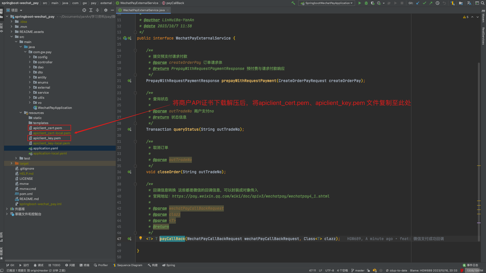

相较于 v2 版本，v3 版本的接口文档在阅读上可能显得相对凌乱。它的组织结构可能不太清晰，难以快速理解整个流程。但是，一旦我们对基本流程有了大致了解，我们可以利用 [wechatpay-java](https://github.com/wechatpay-apiv3/wechatpay-java) 来简化开发过程（一把梭哈）。

相关官方文档：

+ [JSAPI支付-产品介绍](https://pay.weixin.qq.com/docs/merchant/products/jsapi-payment/introduction.html)
+ [JSAPI支付-API](https://pay.weixin.qq.com/docs/merchant/apis/jsapi-payment/direct-jsons/jsapi-prepay.html)
+ [小程序支付API列表](https://pay.weixin.qq.com/wiki/doc/apiv3/open/pay/chapter2_8_3.shtml)
+ [微信公众平台](https://mp.weixin.qq.com/)
+ [微信支付商家助手](https://pay.weixin.qq.com/index.php/core/home/login?return_url=https%3A%2F%2Fpay.weixin.qq.com%2Findex.php%2Fextend%2Fpay_setting%2Fma)

> [springboot-wechat_pay](https://gitee.com/hgw689/springboot-wechat_pay) 示例项目模拟简单电商支付业务，根据官方文档完成前置工作替换项目配置即可使用。希望对您有所帮助！


# 用户付款流程

如图1，用户通过分享或扫描二维码进入商户小程序，用户选择购买，完成选购流程。

步骤2：如图3，调起微信支付控件，用户开始输入支付密码。

|  |  |  |
| ------------------------------------------------------------ | ------------------------------------------------------------ | ------------------------------------------------------------ |
| 图1 打开商户小程序                                           | 图2 请求微信支付                                             | 图3 调起微信支付控件                                         |

如图4，密码验证通过，支付成功。商户后台得到支付成功的通知。

步骤4：如图5，返回商户小程序，显示购买成功。

步骤5：如图6，微信支付公众号下发支付凭证。

|  图4 请求支付成功 |  图5 返回商户小程序 |  |
| ------------------------------------------------------------ | ------------------------------------------------------------ | ------------------------------------------------------------ |
| 图4 请求支付成功                                             | 图5 返回商户小程序                                           | 图6 下发支付凭证                                             |


# 业务流程讲解

业务流程图如下：


重点步骤说明：

步骤4：用户下单发起支付，商户可通过[JSAPI下单](https://pay.weixin.qq.com/wiki/doc/apiv3/apis/chapter3_5_1.shtml)创建支付订单。

步骤9：商户小程序内使用[小程序调起支付API](https://pay.weixin.qq.com/wiki/doc/apiv3/apis/chapter3_5_4.shtml)（wx.requestPayment）发起微信支付，详见[小程序API文档](https://developers.weixin.qq.com/miniprogram/dev/api/payment/wx.requestPayment.html)

步骤16：用户支付成功后，商户可接收到微信支付支付结果通知[支付通知API](https://pay.weixin.qq.com/wiki/doc/apiv3/apis/chapter3_5_5.shtml)。

步骤21：商户在没有接收到微信支付结果通知的情况下需要主动调用[查询订单API](https://pay.weixin.qq.com/wiki/doc/apiv3/apis/chapter3_5_2.shtml)查询支付结果。


# 接入前准备

详细操作流程参考官方文档：https://pay.weixin.qq.com/wiki/doc/apiv3/open/pay/chapter2_8_1.shtml#part-1

- Java 1.8+。
- [成为微信支付商户](https://pay.weixin.qq.com/index.php/apply/applyment_home/guide_normal)。
- [商户 API 证书](https://pay.weixin.qq.com/docs/merchant/development/interface-rules/privatekey-and-certificate.html#%E5%95%86%E6%88%B7api%E8%AF%81%E4%B9%A6)：指由商户申请的，包含[证书序列号](https://pay.weixin.qq.com/docs/merchant/development/interface-rules/certificate-faqs.html#%E5%A6%82%E4%BD%95%E6%9F%A5%E7%9C%8B%E8%AF%81%E4%B9%A6%E5%BA%8F%E5%88%97%E5%8F%B7)、商户的商户号、公司名称、公钥信息的证书。
- [商户 API 私钥](https://pay.weixin.qq.com/docs/merchant/development/interface-rules/privatekey-and-certificate.html#%E5%95%86%E6%88%B7api%E7%A7%81%E9%92%A5)：商户申请商户API证书时，会生成商户私钥，并保存在本地证书文件夹的文件 apiclient_key.pem 中。
- [APIv3 密钥](https://pay.weixin.qq.com/docs/merchant/development/interface-rules/apiv3key.html)：为了保证安全性，微信支付在回调通知和平台证书下载接口中，对关键信息进行了 AES-256-GCM 加密。APIv3 密钥是加密时使用的对称密钥。

> 最终我们需要获取到以下信息：
>
> + **appId**：微信公众号或者小程序等的appId（登陆 微信公众平台，设置 -> 基本设置 -> 账号信息 -> AppID）
> + **merchantId**：微信支付商户号（首先关联商户号，功能 -> 微信支付 -> 商户号管理 -> 已关联商户号）
> + **privateKeyPath**：商户API私钥（[商户 API 证书](https://pay.weixin.qq.com/docs/merchant/development/interface-rules/privatekey-and-certificate.html#%E5%95%86%E6%88%B7api%E8%AF%81%E4%B9%A6)根据文档获取，将`apiclient_key.pem`文件复制至项目路径下。该文件在resource下路径）
> + **merchantSerialNumber**：商户证书序列号（登陆 商户平台，账户中心 -> API安全 -> API证书管理 -> 查看证书号）
> + **apiV3key**：商户APIv3密钥（登陆 商户平台，账户中心 -> API安全的页面 设置该密钥，请求才能通过微信支付的签名校验）
> + **payNotifyUrl**：支付回调通知地址（本项目的回调接口）


# 快速接入

项目结构如下，以及需要注意点



## 1、引入开发库

> Gradle

```arduino
implementation 'com.github.wechatpay-apiv3:wechatpay-java:0.2.10'
```

> Maven

```xml
<dependency>
  <groupId>com.github.wechatpay-apiv3</groupId>
  <artifactId>wechatpay-java</artifactId>
  <version>0.2.10</version>
</dependency>
```


## 2、配置参数

yaml配置文件（这里只对支付参数讲解）：

```yaml
wechat:
  pay:
    # 微信公众号或者小程序等的appId
    appId: XXX
    # 微信支付商户号
    merchantId: XXX
    # 商户证书路径
    certPemPath: /apiclient_cert.pem
    # 商户API私钥路径
    privateKeyPath: /apiclient_key.pem
    # 商户APIv3密钥
    apiV3key: XXXX
    # 支付回调通知地址
    payNotifyUrl: https://XXXX/api/callback/wechat/pay/callback
```

微信支付配置类

```java
package com.gw.pay.config;

import lombok.Data;
import org.springframework.boot.context.properties.ConfigurationProperties;
import org.springframework.stereotype.Component;

/**
 * Description: 微信支付配置类
 *
 * @author LinHuiBa-YanAn
 * @date 2023/10/6 10:27
 */
@Data
@Component
@ConfigurationProperties(prefix = "wechat.pay")
public class WechatPayProperties {
    /**
     * 微信公众号或者小程序等的appId
     */
    private String appId;
    /**
     * 微信支付商户号
     */
    private String merchantId;
    /**
     * 商户证书路径
     */
    private String certPemPath;
    /**
     * 商户API私钥路径
     */
    private String privateKeyPath;
    /**
     * 商户APIv3密钥
     */
    private String apiV3key;
    /**
     * 支付回调通知地址
     */
    private String payNotifyUrl;
}
```


## 3、初始化商户配置

```java
package com.gw.pay.config;

import com.wechat.pay.java.core.Config;
import com.wechat.pay.java.core.RSAAutoCertificateConfig;
import com.wechat.pay.java.core.notification.NotificationConfig;
import com.wechat.pay.java.core.notification.NotificationParser;
import com.wechat.pay.java.service.payments.jsapi.JsapiServiceExtension;
import lombok.extern.slf4j.Slf4j;
import org.springframework.beans.factory.annotation.Autowired;
import org.springframework.context.annotation.Bean;
import org.springframework.context.annotation.Configuration;
import org.springframework.core.io.Resource;
import org.springframework.core.io.ResourceLoader;

import java.io.BufferedReader;
import java.io.IOException;
import java.io.InputStream;
import java.io.InputStreamReader;
import java.security.cert.*;


/**
 * Description: 微信支付相关自动配置
 *
 * @author LinHuiBa-YanAn
 * @date 2023/10/6 10:50
 */
@Slf4j
@Configuration
public class WechatPayAutoConfiguration {

    @Autowired
    private WechatPayProperties properties;

    @Autowired
    private ResourceLoader resourceLoader;

    private static final String CLASS_PATH = "classpath:";


    /**
     * 自动更新证书
     *
     * @return RSAAutoCertificateConfig
     */
    @Bean
    public Config config() throws IOException {
        String path = CLASS_PATH + properties.getCertPemPath();
        Resource resourceCert = resourceLoader.getResource(path);
        X509Certificate certificate = getCertificate(resourceCert.getInputStream());
        String merchantSerialNumber = certificate.getSerialNumber().toString(16).toUpperCase();
        log.info("==========证书序列号：{}，商户信息：{}", merchantSerialNumber, certificate.getSubjectDN());
        String privatePath = CLASS_PATH + properties.getPrivateKeyPath();
        Resource resourcePrivate = resourceLoader.getResource(privatePath);
        String privateKey = inputStreamToString(resourcePrivate.getInputStream());
        log.info("==========加载微信私钥配置:{}", privateKey);
        RSAAutoCertificateConfig config = new RSAAutoCertificateConfig.Builder()
                .merchantId(properties.getMerchantId())
                .privateKey(privateKey)
                .merchantSerialNumber(merchantSerialNumber)
                .apiV3Key(properties.getApiV3key())
                .build();
        return config;
    }

    /**
     * 微信支付对象
     * @param config Config
     * @return JsapiServiceExtension
     */
    @Bean
    public JsapiServiceExtension jsapiServiceExtension(Config config){
        log.info("==========加载微信支付对象");
        JsapiServiceExtension service = new JsapiServiceExtension.Builder().config(config).build();
        return service;
    }

    /**
     * 微信回调对象
     *
     * @param config Config
     * @return NotificationParser
     */
    @Bean
    public NotificationParser notificationParser(Config config) {
        log.info("==========加载微信回调解析对象");
        NotificationParser parser = new NotificationParser((NotificationConfig) config);
        return parser;
    }

    /**
     * 读取私钥文件，将文件流读取成string
     *
     * @param inputStream
     * @return
     * @throws IOException
     */
    public String inputStreamToString(InputStream inputStream) throws IOException {
        BufferedReader reader = new BufferedReader(new InputStreamReader(inputStream));
        StringBuilder stringBuilder = new StringBuilder();
        String line;
        while ((line = reader.readLine()) != null) {
            stringBuilder.append(line);
        }
        reader.close();
        return stringBuilder.toString();
    }

    /**
     * 获取证书 将文件流转成证书文件
     *
     * @param inputStream 证书文件
     * @return {@link X509Certificate} 获取证书
     */
    public static X509Certificate getCertificate(InputStream inputStream) {
        try {
            CertificateFactory cf = CertificateFactory.getInstance("X509");
            X509Certificate cert = (X509Certificate) cf.generateCertificate(inputStream);
            cert.checkValidity();
            return cert;
        } catch (CertificateExpiredException e) {
            throw new RuntimeException("证书已过期", e);
        } catch (CertificateNotYetValidException e) {
            throw new RuntimeException("证书尚未生效", e);
        } catch (CertificateException e) {
            throw new RuntimeException("无效的证书", e);
        }
    }

}
```


## 4、微信支付对接

在接口中定义了提交预支付请求付款、查询状态、取消订单三类核心方法，以及回调信息转换方法。几乎满足最基本的微信支付对接～

```java
package com.gw.pay.external;

import com.gw.pay.external.request.CreateOrderPayRequest;
import com.gw.pay.external.request.WechatPayCallBackRequest;
import com.wechat.pay.java.service.payments.jsapi.model.PrepayWithRequestPaymentResponse;
import com.wechat.pay.java.service.payments.model.Transaction;

/**
 * Description: 微信支付对接 V2（基于JSAPI 支付的扩展类实现）
 *
 * @author LinHuiBa-YanAn
 * @date 2023/10/7 11:38
 */
public interface WechatPayExternalService {

    /**
     * 提交预支付请求付款
     * @param createOrderPay 订单请求体
     * @return PrepayWithRequestPaymentResponse 预付费与请求付款响应
     */
    PrepayWithRequestPaymentResponse prepayWithRequestPayment(CreateOrderPayRequest createOrderPay);

    /**
     * 查询状态
     *
     * @param outTradeNo 商户支付no
     * @return 状态信息
     */
    Transaction queryStatus(String outTradeNo);

    /**
     * 取消订单
     *
     * @param outTradeNo
     */
    void closeOrder(String outTradeNo);

    /**
     * 回调信息转换 这些都是微信的回调信息，可以封装成对象传入
     * 官网地址：https://pay.weixin.qq.com/wiki/doc/apiv3/wechatpay/wechatpay4_1.shtml
     *
     * @param wechatPayCallBackRequest
     * @param clazz
     * @param <T>
     * @return
     */
    <T> T payCallBack(WechatPayCallBackRequest wechatPayCallBackRequest, Class<T> clazz);

}
```

具体实现如下：

```java
package com.gw.pay.external.impl;

import com.gw.pay.config.WechatPayProperties;
import com.gw.pay.external.WechatPayExternalService;
import com.gw.pay.external.request.CreateOrderPayRequest;
import com.gw.pay.external.request.WechatPayCallBackRequest;
import com.wechat.pay.java.core.Config;
import com.wechat.pay.java.core.cipher.PrivacyEncryptor;
import com.wechat.pay.java.core.exception.HttpException;
import com.wechat.pay.java.core.exception.MalformedMessageException;
import com.wechat.pay.java.core.exception.ServiceException;
import com.wechat.pay.java.core.notification.NotificationParser;
import com.wechat.pay.java.core.notification.RequestParam;
import com.wechat.pay.java.service.payments.jsapi.JsapiServiceExtension;
import com.wechat.pay.java.service.payments.jsapi.model.*;
import com.wechat.pay.java.service.payments.model.Transaction;
import lombok.extern.slf4j.Slf4j;
import org.springframework.stereotype.Service;

import javax.annotation.Resource;
import java.math.BigDecimal;
import java.math.RoundingMode;
import java.time.LocalDateTime;
import java.time.format.DateTimeFormatter;

/**
 * Description: 微信支付对接（基于JSAPI 支付的扩展类实现）
 *
 * @author LinHuiBa-YanAn
 * @date 2023/10/7 11:49
 */
@Slf4j
@Service
public class WechatPayExternalServiceImpl implements WechatPayExternalService {

    @Resource
    private Config config;

    @Resource
    private WechatPayProperties properties;

    @Resource
    private JsapiServiceExtension jsapiServiceExtension;

    @Resource
    private NotificationParser notificationParser;

    @Override
    public PrepayWithRequestPaymentResponse prepayWithRequestPayment(CreateOrderPayRequest createOrderPay) {
        log.info("prepayWithRequestPayment");
        PrepayRequest request = new PrepayRequest();
        Amount amount = new Amount();
        BigDecimal payMoney = createOrderPay.getPayMoney();
        BigDecimal amountTotal = payMoney.multiply(new BigDecimal("100").setScale(0, RoundingMode.DOWN));
        amount.setTotal(amountTotal.intValue());
        request.setAmount(amount);
        Payer payer = new Payer();
        payer.setOpenid(createOrderPay.getOpenId());
        request.setPayer(payer);
        request.setTimeExpire(getExpiredTimeStr());
        request.setAppid(properties.getAppId());
        request.setMchid(properties.getMerchantId());
        request.setAttach(String.valueOf(createOrderPay.getId()));
        request.setDescription(createOrderPay.getPayContent());
        request.setNotifyUrl(properties.getPayNotifyUrl());
        //这里生成流水号，后续用这个流水号与微信交互，查询订单状态
        request.setOutTradeNo(createOrderPay.getOutTradeNo());
        PrepayWithRequestPaymentResponse result;
        try {
            result = jsapiServiceExtension.prepayWithRequestPayment(request);
        } catch (HttpException e) {
            log.error("微信下单发送HTTP请求失败，错误信息：{}", e.getHttpRequest());
            throw new RuntimeException("微信下单发送HTTP请求失败", e);
        } catch (ServiceException e) {
            // 服务返回状态小于200或大于等于300，例如500
            log.error("微信下单服务状态错误，错误信息：{}", e.getErrorMessage());
            throw new RuntimeException("微信下单服务状态错误", e);
        } catch (MalformedMessageException e) {
            // 服务返回成功，返回体类型不合法，或者解析返回体失败
            log.error("服务返回成功，返回体类型不合法，或者解析返回体失败，错误信息：{}", e.getMessage());
            throw new RuntimeException("服务返回成功，返回体类型不合法，或者解析返回体失败", e);
        }
        log.info("prepayWithRequestPayment end");
        return result;
    }

    @Override
    public Transaction queryStatus(String outTradeNo) {
        QueryOrderByOutTradeNoRequest request = new QueryOrderByOutTradeNoRequest();
        request.setMchid(properties.getMerchantId());
        request.setOutTradeNo(outTradeNo);
        try {
            return jsapiServiceExtension.queryOrderByOutTradeNo(request);
        } catch (ServiceException e) {
            log.error("订单查询失败，返回码：{},返回信息：{}", e.getErrorCode(), e.getErrorMessage());
            throw new RuntimeException("订单查询失败", e);
        }
    }

    @Override
    public void closeOrder(String outTradeNo) {
        log.info("closeOrder");
        CloseOrderRequest closeRequest = new CloseOrderRequest();
        closeRequest.setMchid(properties.getMerchantId());
        closeRequest.setOutTradeNo(outTradeNo);
        try {
            //方法没有返回值，意味着成功时API返回204 No Content
            jsapiServiceExtension.closeOrder(closeRequest);
        } catch (ServiceException e) {
            log.error("订单关闭失败，返回码：{},返回信息：{}", e.getErrorCode(), e.getErrorMessage());
            throw new RuntimeException("订单关闭失败", e);
        }
    }

    @Override
    public <T> T payCallBack(WechatPayCallBackRequest wechatPayCallBackRequest, Class<T> clazz) {
        log.info("payCallBack");
        PrivacyEncryptor privacyEncryptor = config.createEncryptor();
        String weChatPayCertificateSerialNumber = privacyEncryptor.getWechatpaySerial();
        if (!wechatPayCallBackRequest.getSerial().equals(weChatPayCertificateSerialNumber)) {
            log.error("证书不一致");
            throw new RuntimeException("证书不一致");
        }
        RequestParam requestParam = new RequestParam.Builder()
                .serialNumber(wechatPayCallBackRequest.getSerial())
                .nonce(wechatPayCallBackRequest.getNonce())
                .signType(wechatPayCallBackRequest.getSignatureType())
                .signature(wechatPayCallBackRequest.getSignature())
                .timestamp(wechatPayCallBackRequest.getTimestamp())
                .body(wechatPayCallBackRequest.getBody())
                .build();
        return notificationParser.parse(requestParam, clazz);
    }


    /**
     * 获取失效时间
     */
    private String getExpiredTimeStr() {
        //失效时间，10分钟
        LocalDateTime now = LocalDateTime.now();
        LocalDateTime expiredTime = now.plusMinutes(10);
        DateTimeFormatter formatter = DateTimeFormatter.ofPattern("yyyy-MM-dd'T'HH:mm:ss.SSS'Z'");
        return formatter.format(expiredTime);
    }
}
```

其中使用到的 **提交预支付请求付款请求体** 实体类：

```java
/**
 * Description: 提交预支付请求付款请求体
 *
 * @author LinHuiBa-YanAn
 * @date 2023/10/6 17:06
 */
@Data
public class CreateOrderPayRequest {
    /**
     * 主键id
     */
    private Long id;

    /**
     * 商户支付no 和微信交互 查询订单使用（outTradeNo）
     */
    private String outTradeNo;

    /**
     * 用户openid
     */
    private String openId;

    /**
     * 支付金额
     */
    private BigDecimal payMoney;

    /**
     * 支付内容
     */
    private String payContent;
}
```

> 自测一下

```java
@ActiveProfiles("local")
@SpringBootTest
class SpringbootWechatPayApplicationTests {

    @Resource
    private WechatPayExternalService wechatPayExternalService;


    @Test
    void prepayWithRequestPayment() {
        CreateOrderPayRequest createOrderRequest = new CreateOrderPayRequest();
        createOrderRequest.setId(1001L);
        createOrderRequest.setOutTradeNo("100000004");
        createOrderRequest.setOpenId("oKwQd5MtFfgnXyLBp7vC6Pe3HAJQ");
        createOrderRequest.setPayMoney(new BigDecimal("0.01"));
        createOrderRequest.setPayContent("商机直租会员续费");
        PrepayWithRequestPaymentResponse response = wechatPayExternalService.prepayWithRequestPayment(createOrderRequest);
        System.out.println(JSONObject.toJSONString(response));
    }

    @Test
    void queryStatus() {
        Transaction result = wechatPayExternalService.queryStatus("100000004");
        System.out.println(JSONObject.toJSONString(result));
        if (Transaction.TradeStateEnum.SUCCESS.equals(result.getTradeState())) {
            System.out.println("支付成功");
        } else {
            System.out.println("支付失败");
        }
    }

    @Test
    void closeOrderV2() {
        wechatPayExternalService.closeOrder("100000004");
    }

}
```


## 5、支付回调-支付通知API

微信支付通过支付通知接口将用户支付成功消息通知给商户，文档地址：[pay.weixin.qq.com/wiki/doc/ap…](https://link.juejin.cn/?target=https%3A%2F%2Fpay.weixin.qq.com%2Fwiki%2Fdoc%2Fapiv3%2Fapis%2Fchapter3_5_5.shtml)

> **注意**：
>
> + 同样的通知可能会多次发送给商户系统。商户系统必须能够正确处理重复的通知。 推荐的做法是，当商户系统收到通知进行处理时，先检查对应业务数据的状态，并判断该通知是否已经处理。如果未处理，则再进行处理；如果已处理，则直接返回结果成功。在对业务数据进行状态检查和处理之前，要采用数据锁进行并发控制，以避免函数重入造成的数据混乱。
> + 如果在所有通知频率后没有收到微信侧回调，商户应调用查询订单接口确认订单状态。

```java
package com.gw.pay.controller;

import cn.hutool.http.HttpUtil;
import com.alibaba.fastjson.JSON;
import com.alibaba.fastjson.JSONObject;
import com.gw.pay.service.OrderService;
import lombok.extern.slf4j.Slf4j;
import org.springframework.beans.factory.annotation.Value;
import org.springframework.http.HttpStatus;
import org.springframework.web.bind.annotation.RequestMapping;
import org.springframework.web.bind.annotation.RequestMethod;
import org.springframework.web.bind.annotation.RestController;

import javax.annotation.Resource;
import javax.servlet.http.HttpServletRequest;
import javax.servlet.http.HttpServletResponse;
import java.io.IOException;
import java.util.HashMap;
import java.util.Map;

/**
 * Description: 微信支付回调接口
 *
 * @author LinHuiBa-YanAn
 * @date 2023/10/6 11:18
 */
@Slf4j
@RestController
@RequestMapping("/api/callback/wechat/pay")
public class WechatPayCallbackController {

    @Value("${config.bot.url}")
    private String botUrl;

    @Resource
    private OrderService orderService;

    /**
     * 回调接口
     *
     * @param request
     * @return
     * @throws IOException
     */
    @RequestMapping(value = "/callback", method = {RequestMethod.POST, RequestMethod.GET})
    public Map<String, String> payCallback(HttpServletRequest request, HttpServletResponse response) {
        log.info("------收到支付通知------");
        Map<String, String> result = new HashMap<>();
        try {
            orderService.payCallBack(request);
            result.put("code", "SUCCESS");
            result.put("message", "成功");
            return result;
        } catch (Exception e) {
            log.error("支付处理失败,req:{}", request, e);
            alarm();
            response.setStatus(HttpStatus.INTERNAL_SERVER_ERROR.value());
            result.put("code", "FAIL");
            result.put("message", e.getMessage());
            return result;
        }
    }

    /**
     * 企业微信群告警
     */
    private void alarm() {
        JSONObject messageReq = new JSONObject();
        messageReq.put("msgtype", "text");
        JSONObject text = new JSONObject();
        text.put("content", "【商业直租】支付处理失败！" );
        messageReq.put("text", text);
        String url = botUrl;
        String reqStr = JSON.toJSONString(messageReq);
        HttpUtil.post(url, reqStr, 30000);
    }

}
```

我们在 OrderService 定义了微信支付回调方法，让controller看上去更简洁一点～

```java
/**
 * Description: 订单管理
 *
 * @author LinHuiBa-YanAn
 * @date 2023/10/11 19:45
 */
public interface OrderService {
  
    /**
     * 微信支付回调
     * @param request HttpServletRequest
     */
    void payCallBack(HttpServletRequest request) throws Exception;

}
```

具体实现方法：

```java
package com.gw.pay.service.impl;

import cn.hutool.core.convert.Convert;
import com.alibaba.fastjson.JSONObject;
import com.gw.pay.dao.OrderDao;
import com.gw.pay.dao.PayLogDao;
import com.gw.pay.entity.OrderPO;
import com.gw.pay.entity.PayLogPO;
import com.gw.pay.enums.OrderPayStatusEnum;
import com.gw.pay.enums.OrderStatusEnum;
import com.gw.pay.enums.WechatPayCallBackHeaderConstant;
import com.gw.pay.external.WechatPayExternalService;
import com.gw.pay.external.request.CreateOrderPayRequest;
import com.gw.pay.external.request.WechatPayCallBackRequest;
import com.gw.pay.service.OrderService;
import com.gw.pay.utils.NumberGenerate;
import com.gw.pay.vo.OrderPayVO;
import com.gw.pay.vo.StatusVO;
import com.wechat.pay.java.service.payments.jsapi.model.PrepayWithRequestPaymentResponse;
import com.wechat.pay.java.service.payments.model.Transaction;
import lombok.extern.slf4j.Slf4j;
import org.redisson.api.RLock;
import org.redisson.api.RedissonClient;
import org.springframework.stereotype.Service;

import javax.annotation.Resource;
import javax.servlet.http.HttpServletRequest;
import java.io.BufferedReader;
import java.math.BigDecimal;
import java.time.LocalDateTime;
import java.time.format.DateTimeFormatter;
import java.util.Objects;

/**
 * Description: 订单
 *
 * @author LinHuiBa-YanAn
 * @date 2023/10/11 19:46
 */
@Slf4j
@Service
public class OrderServiceImpl implements OrderService {
    @Resource
    private OrderDao orderDao;

    @Resource
    private PayLogDao payLogDao;

    @Resource
    private WechatPayExternalService wechatPayExternalService;

    @Resource
    private RedissonClient redissonClient;

    /**
     * 分布式锁
     */
    private final String LOCK_KEY = "WECHAT_PAY_LOCK:";

    @Override
    public void payCallBack(HttpServletRequest request) throws Exception {
        BufferedReader reader = request.getReader();
        String line;
        StringBuilder sb = new StringBuilder();
        while ((line = reader.readLine()) != null) {
            sb.append(line);
        }
        WechatPayCallBackRequest callBackRequest = new WechatPayCallBackRequest();
        callBackRequest.setBody(sb.toString());
        callBackRequest.setNonce(request.getHeader(WechatPayCallBackHeaderConstant.NONCE));
        callBackRequest.setSerial(request.getHeader(WechatPayCallBackHeaderConstant.SERIAL));
        callBackRequest.setSignature(request.getHeader(WechatPayCallBackHeaderConstant.SIGNATURE));
        callBackRequest.setSignatureType(request.getHeader(WechatPayCallBackHeaderConstant.SIGNATURE_TYPE));
        callBackRequest.setTimestamp(request.getHeader(WechatPayCallBackHeaderConstant.TIMESTAMP));
        log.info("验签参数{}", JSONObject.toJSONString(callBackRequest));
        Transaction transaction = wechatPayExternalService.payCallBack(callBackRequest, Transaction.class);
        log.info("验签成功！-支付回调结果：{}", transaction.toString());

        String lockKey = LOCK_KEY + transaction.getOutTradeNo();
        RLock lock = redissonClient.getLock(lockKey);
        try {
            boolean isLock = lock.tryLock();
            if (!isLock) {
                throw new RuntimeException("请勿重复操作");
            }
            log.info("开始用户支付后业务处理");
            processTransaction(transaction);
            log.info("用户支付后业务处理成功");
        } catch (Exception e) {
            log.error("用户支付后业务处理错误, e{}", e);
            throw e;
        } finally {
            // 释放锁
            lock.unlock();
        }
    }

    /**
     * 处理回调业务(需要保证事务操作哦)
     * @param transaction Transaction
     */
    private void processTransaction(Transaction transaction) {
        // 修改订单前，主动请求微信查询订单是否支付成功，防止恶意post
        transaction = wechatPayExternalService.queryStatus(transaction.getOutTradeNo());
        if (Transaction.TradeStateEnum.SUCCESS != transaction.getTradeState()) {
            log.info("内部订单号【{}】,微信支付订单号【{}】支付未成功", transaction.getOutTradeNo(), transaction.getTransactionId());
            throw new RuntimeException("订单支付未成功");
        }
        // 修改支付信息
        PayLogPO payLog = payLogDao.getByOutTradeNo(transaction.getOutTradeNo());
        if (OrderPayStatusEnum.PAY_SUCCESS.getCode().equals(payLog.getStatus())) {
            // 若订单状态已为支付成功则不处理
            return;
        }
        payLog.setTransactionId(transaction.getTransactionId());
        if (Objects.nonNull(transaction.getSuccessTime())) {
            payLog.setPayTime(LocalDateTime.parse(transaction.getSuccessTime(), DateTimeFormatter.ISO_OFFSET_DATE_TIME));
        }
        payLog.setStatus(OrderPayStatusEnum.PAY_SUCCESS.getCode());
        payLogDao.store(payLog);
        // 修改订单信息
        OrderPO order = orderDao.getById(payLog.getOrderId());
        order.setStatus(OrderStatusEnum.DELIVER_GOODS.getCode());
        orderDao.store(order);
        // 其他业务操作
    }
}
```

> 项目中基于redis实现分布式锁，保证幂等性和防止并发冲突。对于Redis实现分布式锁想要进一步了解的小伙伴可查看小编的另外一篇博文[Redis分布式锁](https://blog.csdn.net/m0_49183244/article/details/126952345?spm=1001.2014.3001.5502)